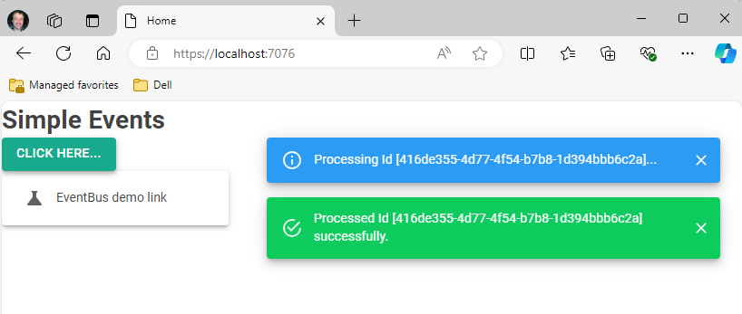
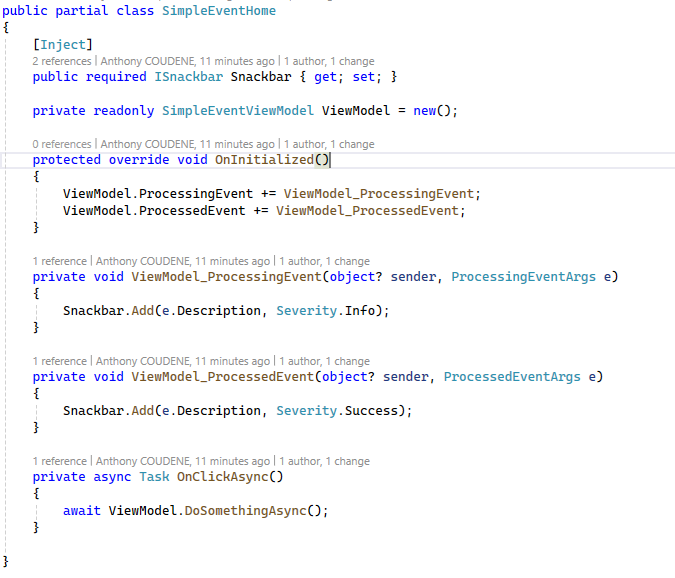
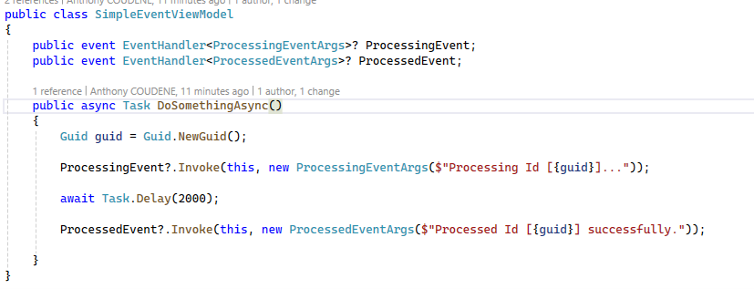
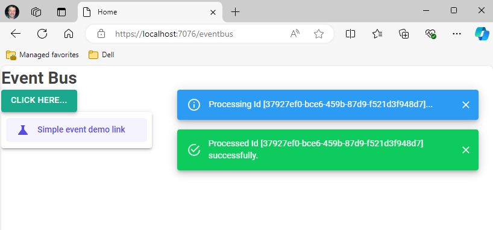
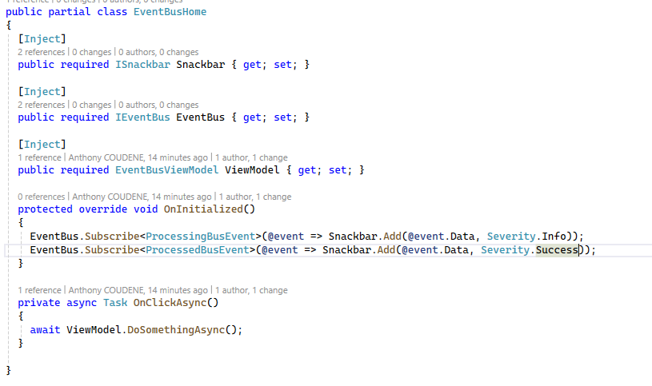
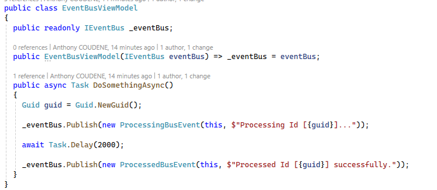
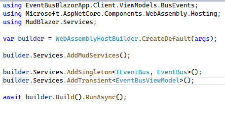

_2024-10-17 - Anthony Coudène - Création_

# Le mode simple utilisant une gestion des events classiques C#

via : 

- Une page : **SimpleEventHome**
- Un ViewModel : **SimpleEventViewModel**
- 2 arguments d'events classiques : **ProcessingEventArgs** et **ProcessedEventArgs**

On retrouve du code classique d'abonnement :

Et ici : l'envoi de notification d'event :

Dans le 2ème cas accessible par le NavLink ou le path relatif /eventbus, on va retrouver une autre approche que j'ai isolée très vite fait (attention code à ne pas reprendre encore en production), la suite.

# Le mode avec Event Bus local

- Une page : **EventBusHome**
- Un ViewModel injecté : **EventBusViewModel**
- 2 events autosuffisants (message+data) : **ProcessingBusEvent** et **ProcessedBusEvent**
- Un bus d'évènement local au process (attention le terme est le même que celui des MOMs mais ce n'est pas un MOM !!!!) : **IEventBus**

Voici le nouveau code d'abonnement :

Et le code de notification :

On voit qu'on ne gère plus que du C# sans se soucier de la gestion évènementielle qui peut induire des memory leaks ou des problèmes particuliers si on ne respecte pas les best practices.

Pour initialiser le tout, on va avoir la main sur les durées de vie et le partage des espaces de notifications. Ici, j'ai choisi un singleton par exemple :

On parle de bus d'évènement mais il s'agit ici d'une gestion encapsulée des events C# au sein d'un même processus.

